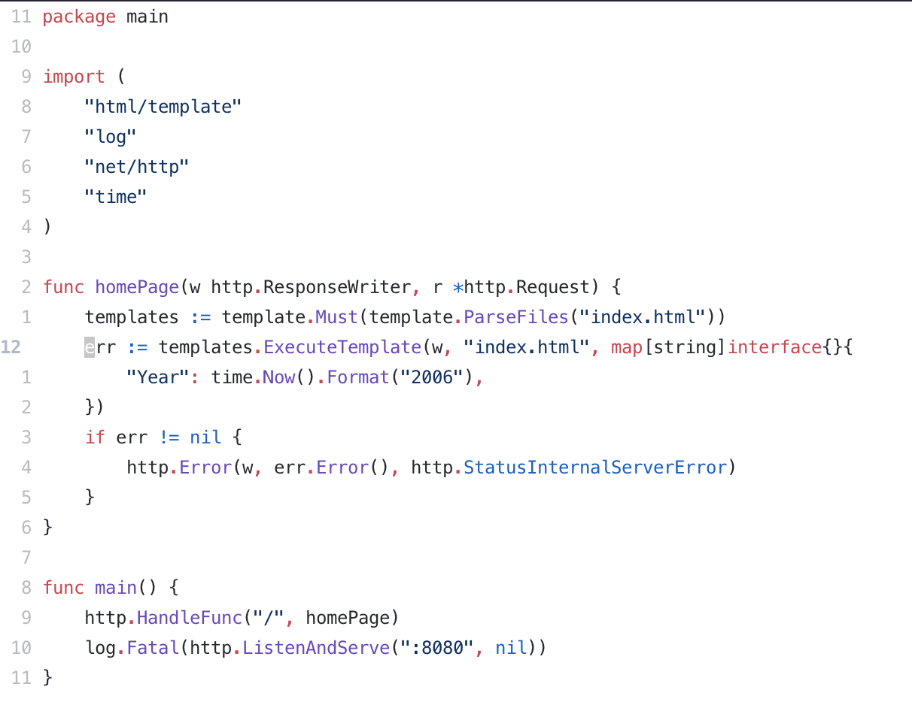
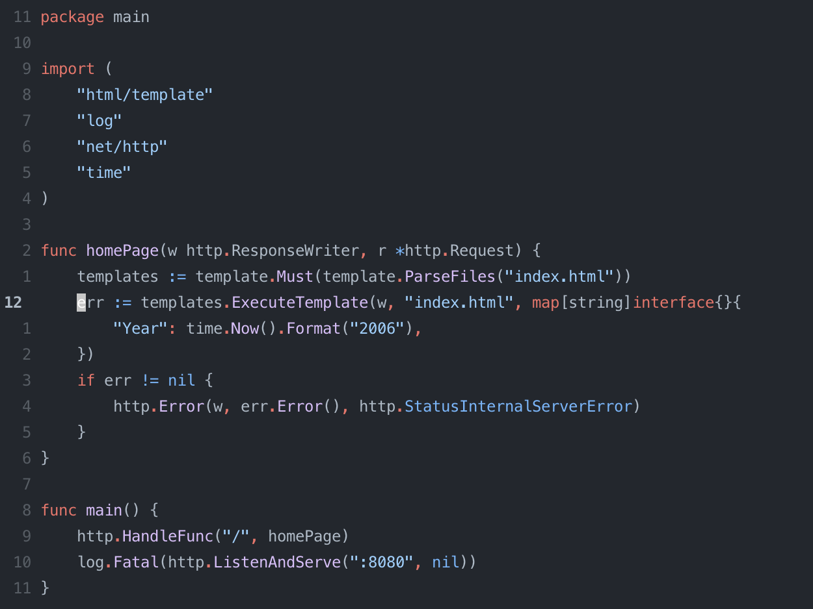

# GitHub's colourscheme for Neovim

Currently only supports [nvim-treesitter](https://github.com/nvim-treesitter/nvim-treesitter)

## Why?

I like consistency and really enjoy the new GitHub Dimmed colourscheme. When
jumping between reviewing PRs and my editor it feels good to look at a similar
environment.

## Screenshots (Go)

### Light

### Dimmed

